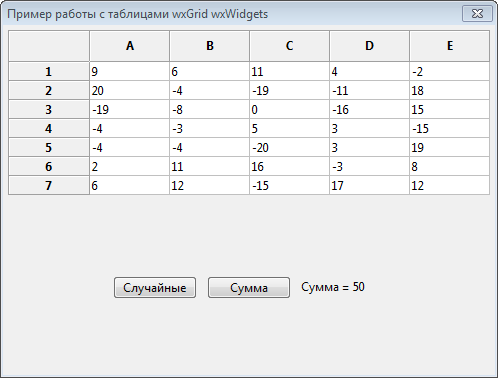

# wxwidgets_table_demo
Пример программы с таблицей на С++ в Code::Blocks с использованием wxWidgets



```
// Случайные числа в таблицу
void wxwidgets_table_demoDialog::OnButton1Click(wxCommandEvent& event)
{
    int rc = Grid1 -> GetNumberRows(); // Определяем количество строк в таблице
    int cc = Grid1 -> GetNumberCols(); // Определяем количество столбцов в таблице
    // Перебираем все строки таблицы
    for(int i=0; i<rc; i++)
    {
        // Перебираем все столбцы таблицы
        for(int j=0; j<cc; j++)
        {
            int r = std::rand() % 41 - 20; // Генерируем случайное число
            // Преобразуем число в строку
            std::ostringstream foo;
            foo << r;
            Grid1 -> SetCellValue(i,j, foo.str()); // Занесем в ячейку таблицы нужное значение
        }
    }
    // Программно нажмем на кнопку расчета суммы
    OnButton2Click(event);
}

// Сумма чисел в таблице
void wxwidgets_table_demoDialog::OnButton2Click(wxCommandEvent& event)
{
    int rc = Grid1 -> GetNumberRows(); // Определяем количество строк в таблице
    int cc = Grid1 -> GetNumberCols(); // Определяем количество столбцов в таблице
    int sum = 0;
    wxString ss;

    // Перебираем все строки таблицы
    for(int i=0; i<rc; i++)
    {
        // Перебираем все столбцы таблицы
        for(int j=0; j<cc; j++)
        {
            ss = Grid1 -> GetCellValue(i,j); // Считываем текстовое значение ячейки таблицы
            sum += strtol(ss, NULL, 0); // Накапливаем в переменной значение суммы, преобразовав в число значение ячейки
        }
    }
    // Преобразуем число в строку
    std::ostringstream foo;
    foo << sum;
    StaticText1->SetLabel("Сумма = " + foo.str()); // Выдадим в компонент значение суммы
}
```
